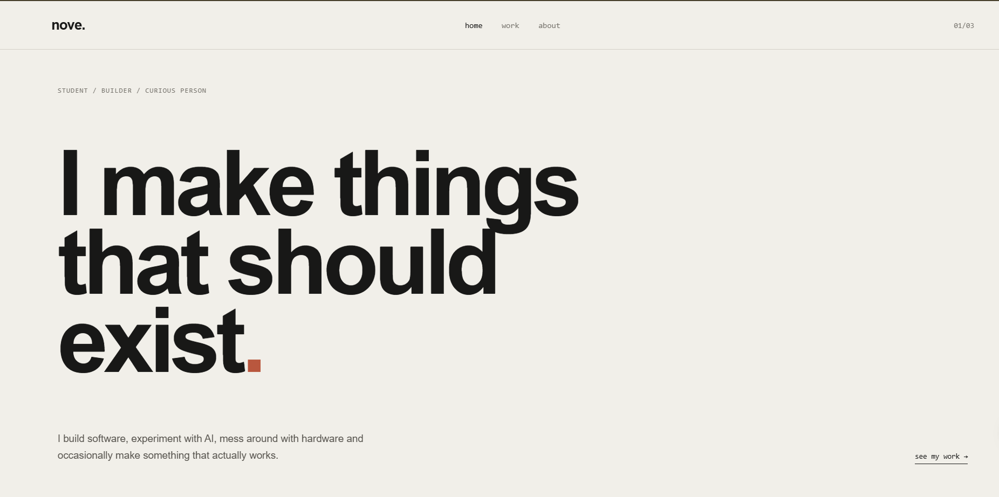
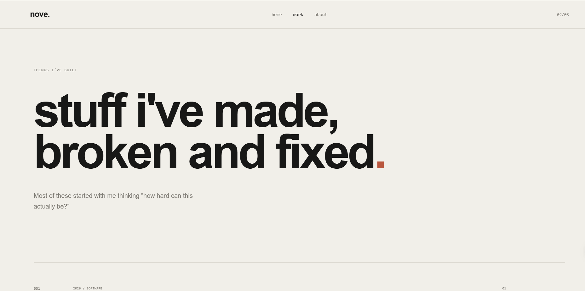

# Hey there,

Iam *Azar Zayan*, so who is nove ?. Ohh that's my madeup name BTW. Ok so this is the website i am gonna show as my
resume and portfolio. As a tech enthusiast i know whats the difference between a paper printed cv and a website 
portfolio if its a tech company. So i made this website as my personal portfolio website.

As the website footer says "All rights not reserved" you can use it boys. hehe, and also if you need any helps doing it
just mail to be azarazarzayan@gmail.com is my personal email address. 

Some Quick Previews :

Here is the small setup guide :

1, Clone this repo and open it in a code editor like vs code, or something. 
2, Install the live server extension in Vs code. 
3, Write click inside the index.html file. 
4, Then now you can preview it my boy XD. 